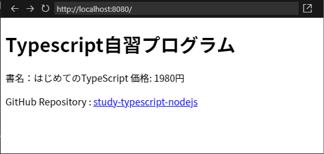

# Webpackのインストール

## リポジトリの取得後に最初にすること

コマンドラインから

```sh
npm -install
```
によって必要なモジュールを取得する。取得すべきモジュールはpackage.jsonに記述してある。取得したモジュールはnode_modulesに展開される。

node_modulesは容量が大きく、また、npm --installで簡単に取得できる。そのためgithubでリポジトリを作った際、node用に.gitignoreを生成するとnode_modulesはgitによって追跡されない設定となる。

## この例題について

Webpackを使ったTypescript開発環境の構築方法を説明する。
- Ubuntu 24.04 (WSL)
- node v18.19.1
- npm 9.2.0
- tsc 5.6.3
- webpack 5.96.1
- Visual Studio Code 1.95.3

[TypeScriptチュートリアル -環境構築編-](https://qiita.com/ochiochi/items/efdaa0ae7d8c972c8103)の内容をほぼそのままコピーした。

## 作業手順

最初に必要なモジュールをローカル・ディレクトリに取得する。TS/JSではプロジェクトとモジュールが密に結合するため、バージョン地獄を回避するなどの理由でローカルへのモジュール展開が推奨されている。

```sh
npm install typescript ts-loader webpack webpack-cli webpack-dev-server --save-dev
```
このコマンドを実行すると、ローカルに取得したモジュールがpackage.jsonに記録され、依存性情報として利用できるようになる(devDependencies)。 それ以外の項目は自分で記録した。

scripts項目は、npmに対してビルド時とスタート時の挙動を指定している。npm build, npm startのように使う。なお、スタート後はwebpackがソース変更を検知して自動的にビルドする。

```json:package.json
{
  "name": "ts_tutorial",
  "version": "1.0.0",
  "description": "",
  "main": "index.js",
  "scripts": {
    "build": "webpack --mode=development",
    "start": "webpack serve --mode=development"
  },
  "keywords": [],
  "author": "",
  "license": "ISC",
  "devDependencies": {
    "ts-loader": "^4.0.0",
    "typescript": "^2.7.2",
    "webpack": "^4.0.1",
    "webpack-cli": "^2.0.10",
    "webpack-dev-server": "^3.1.0"
  }
}
```

Webpackの設定ファイルは[TypeScriptチュートリアル -環境構築編-](https://qiita.com/ochiochi/items/efdaa0ae7d8c972c8103)のものをそのままコピーした。

```js:webpack.config.js
const path = require('path');
module.exports = {
    // モジュールバンドルを行う起点となるファイルの指定
    // 指定できる値としては、ファイル名の文字列や、それを並べた配列やオブジェクト
    // 下記はオブジェクトとして指定した例 
    entry: {
        bundle: './src/app.ts'
    },  
    output: {
        // モジュールバンドルを行った結果を出力する場所やファイル名の指定
        // "__dirname"はこのファイルが存在するディレクトリを表すnode.jsで定義済みの定数
        path: path.join(__dirname,'dist'),
        filename: '[name].js'  // [name]はentryで記述した名前(この例ではbundle）が入る
    },
    // モジュールとして扱いたいファイルの拡張子を指定する
    // 例えば「import Foo from './foo'」という記述に対して"foo.ts"という名前のファイルをモジュールとして探す
    // デフォルトは['.js', '.json']
    resolve: {
        extensions:['.ts','.js']
    },
    devServer: {
        // webpack-dev-serverの公開フォルダ
        static: {
            directory: path.join(__dirname, "dist"),
        },
    },
    // モジュールに適用するルールの設定（ここではローダーの設定を行う事が多い）
    module: {
        rules: [
            {
                // 拡張子が.tsで終わるファイルに対して、TypeScriptコンパイラを適用する
                test:/\.ts$/,loader:'ts-loader'
            }
        ]
    }
}

```
設定ファイルができたらTypescriptコンパイラのデフォルト設定ファイルを生成する。
```sh
tsc --init
```
tsconfig.jsonが生成される。コンパイル・オプションはこのファイルで指定する。

最後にアプリケーションのソースコードを作る。これらも[TypeScriptチュートリアル -環境構築編-](https://qiita.com/ochiochi/items/efdaa0ae7d8c972c8103)からそのままコピーした。

- [src/app.ts](src/app.ts)
- [src/item.ts](src/item.ts)
- [dst/index.html](dist/index.html)
npm startスクリプトを実行すると、webpackがサーバーを起動する。
```sh
npm start
```
localhost:8080でサーバーにアクセスできる。
